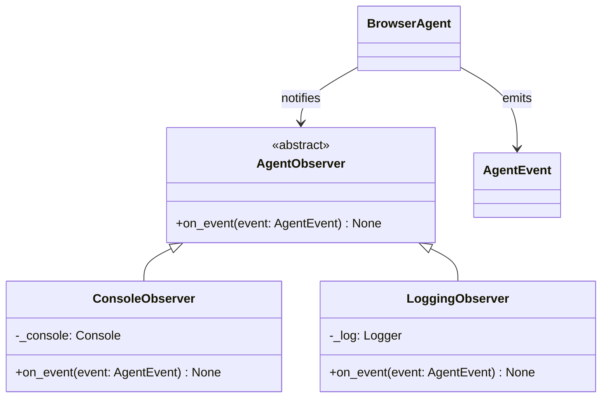
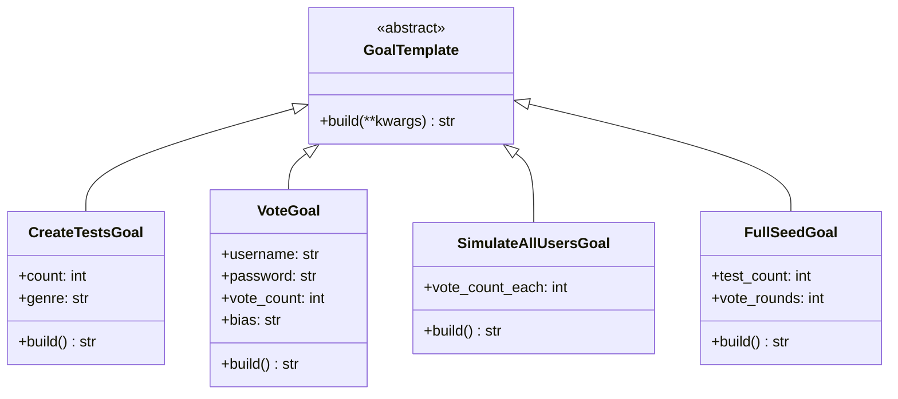

# tot_agent.agent

Core agentic loop, Observer pattern implementation, and Goal template builders.

## Observer pattern classes

## Goal template hierarchy

## Module reference

::: tot_agent.agent
    options:
      members:
        - EventType
        - AgentEvent
        - AgentObserver
        - ConsoleObserver
        - LoggingObserver
        - BrowserAgent
        - GoalTemplate
        - CreateTestsGoal
        - VoteGoal
        - SimulateAllUsersGoal
        - FullSeedGoal
