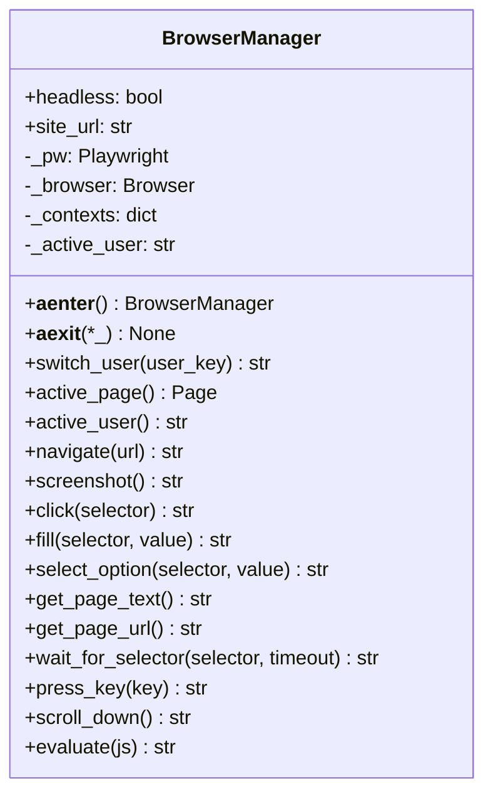
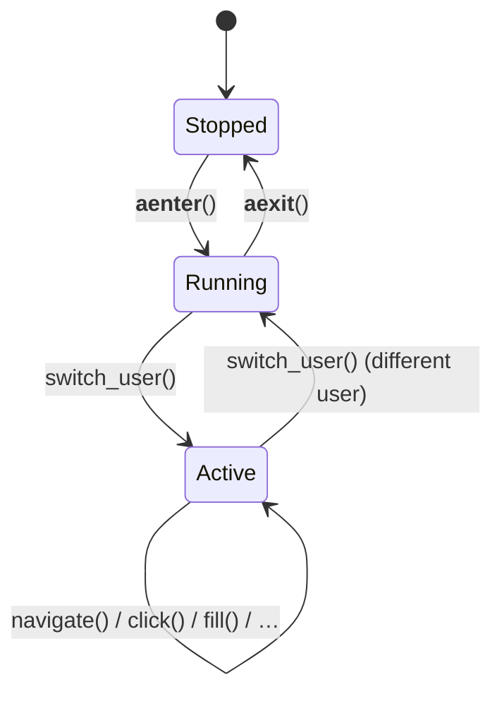

# tot_agent.browser

Playwright browser context pool.

## Class diagram

```mermaid
classDiagram
    class BrowserManager {
        +headless: bool
        +site_url: str
        -_pw: Playwright
        -_browser: Browser
        -_contexts: dict
        -_active_user: str
        +__aenter__() BrowserManager
        +__aexit__(*_) None
        +switch_user(user_key) str
        +active_page() Page
        +active_user() str
        +navigate(url) str
        +screenshot() str
        +click(selector) str
        +fill(selector, value) str
        +select_option(selector, value) str
        +get_page_text() str
        +get_page_url() str
        +wait_for_selector(selector, timeout) str
        +press_key(key) str
        +scroll_down() str
        +evaluate(js) str
    }
```

## Context lifecycle

```mermaid
stateDiagram-v2
    [*] --> Stopped
    Stopped --> Running : __aenter__()
    Running --> Active : switch_user()
    Active --> Active : navigate() / click() / fill() / …
    Active --> Running : switch_user() (different user)
    Running --> Stopped : __aexit__()
```

## Module reference

::: tot_agent.browser
    options:
      members:
        - BrowserManager
