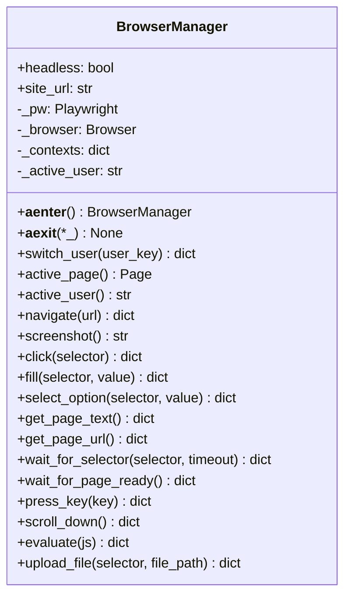
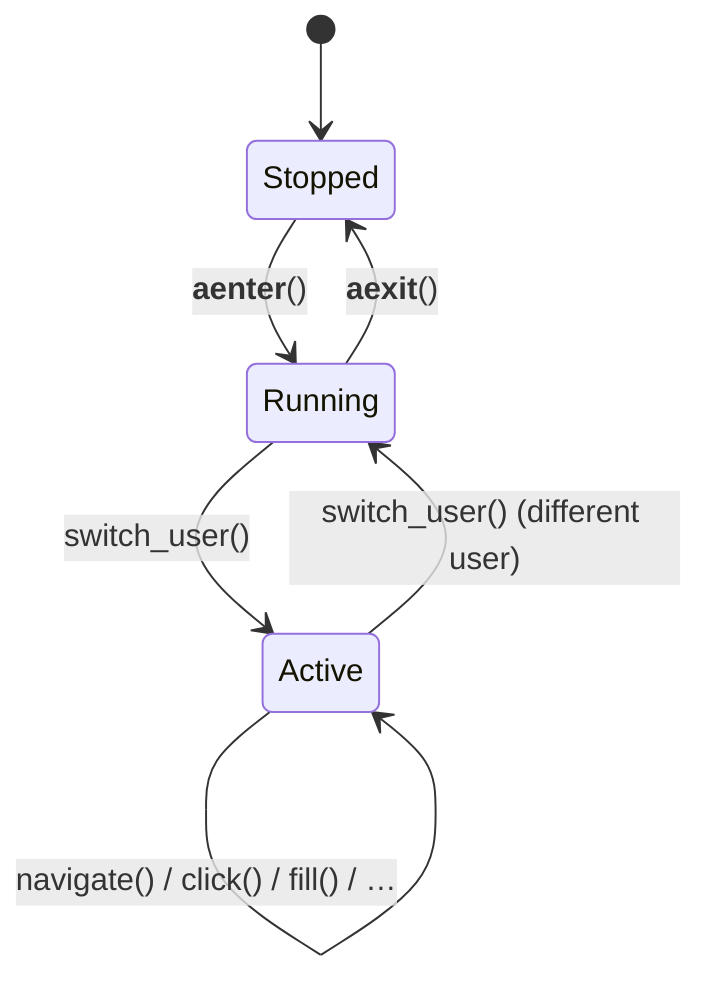

# tot_agent.browser

Playwright browser context pool.

## Class diagram

## Context lifecycle

## Structured results

All action methods return a `dict` with a consistent shape produced by helpers
in `results.py`:

| Key | Type | Description |
|---|---|---|
| `ok` | `bool` | `True` on success, `False` on failure |
| `message` | `str` | Human-readable summary |
| `data` | `dict` | Method-specific payload (e.g. `{"url": "..."}`) |
| `error` | `str` | Error detail (only present when `ok` is `False`) |
| `recoverable` | `bool` | `True` when a timeout or transient error occurred |

## Module reference

::: tot_agent.browser
    options:
      members:
        - BrowserManager
