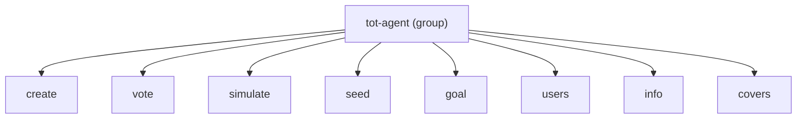

# tot_agent.cli

Click-based command-line interface.

## Command tree

## Module reference

::: tot_agent.cli
    options:
      members:
        - cli
        - create
        - vote
        - simulate
        - seed
        - goal
        - users
        - info
        - covers
