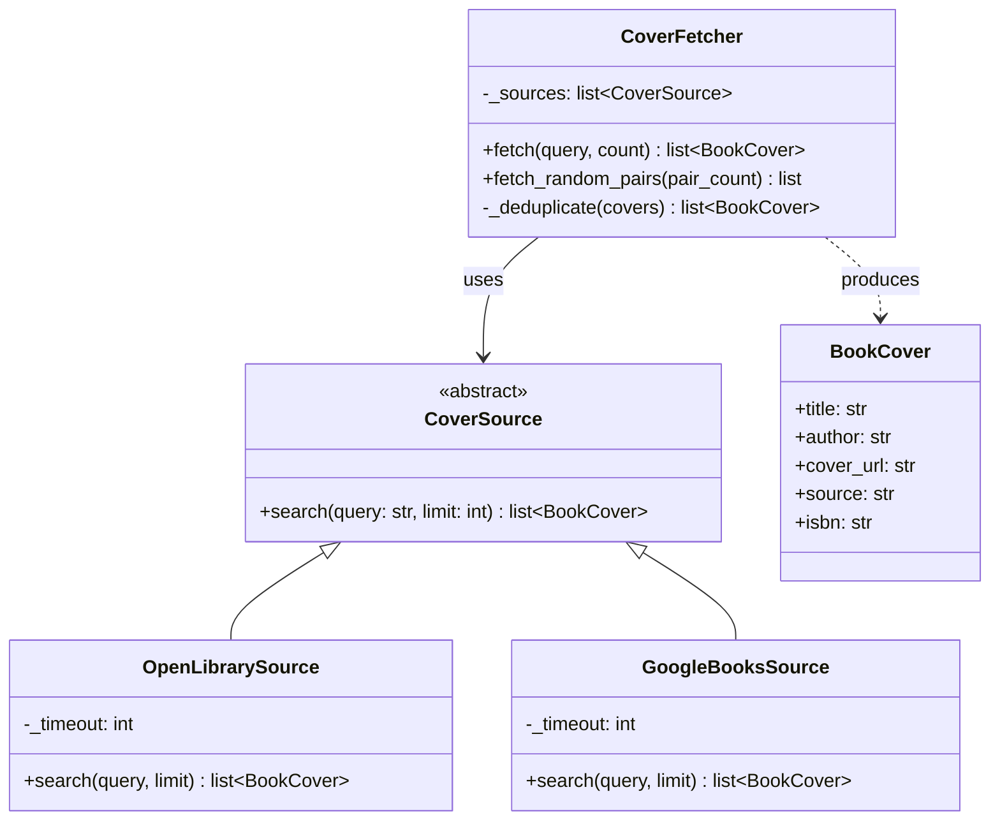
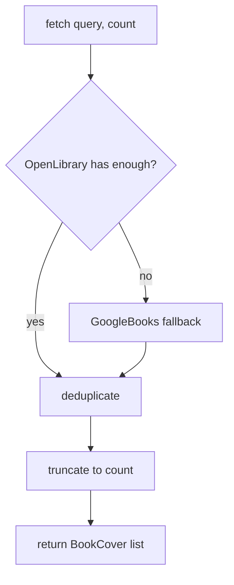
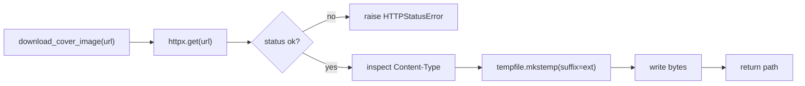

# tot_agent.covers

Book cover fetching with the Strategy design pattern.

## Class diagram

## Fetch flow

## Image download

`download_cover_image(url)` downloads a cover image to a local temp file and
returns the path.  The caller is responsible for deleting the file after use.

The extension is derived from the `Content-Type` response header:

| Content-Type | Extension |
|---|---|
| `image/jpeg` | `.jpg` |
| `image/png` | `.png` |
| `image/gif` | `.gif` |
| `image/webp` | `.webp` |
| `image/bmp` | `.bmp` |
| *(other)* | `.jpg` |

## Module reference

::: tot_agent.covers
    options:
      members:
        - BookCover
        - CoverSource
        - OpenLibrarySource
        - GoogleBooksSource
        - CoverFetcher
        - download_cover_image
        - verify_cover_url
        - fetch_book_covers
        - fetch_random_cover_pairs
