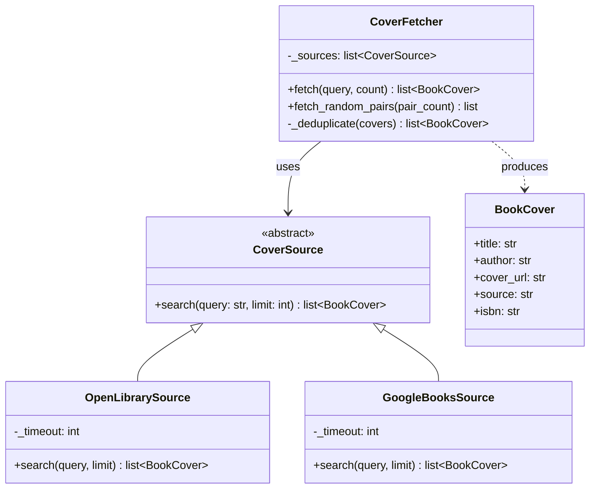
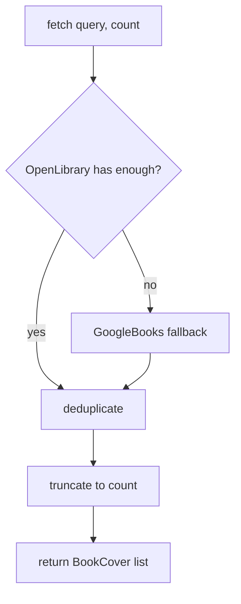

# tot_agent.covers

Book cover fetching with the Strategy design pattern.

## Class diagram

## Fetch flow

## Module reference

::: tot_agent.covers
    options:
      members:
        - BookCover
        - CoverSource
        - OpenLibrarySource
        - GoogleBooksSource
        - CoverFetcher
        - verify_cover_url
        - fetch_book_covers
        - fetch_random_cover_pairs
