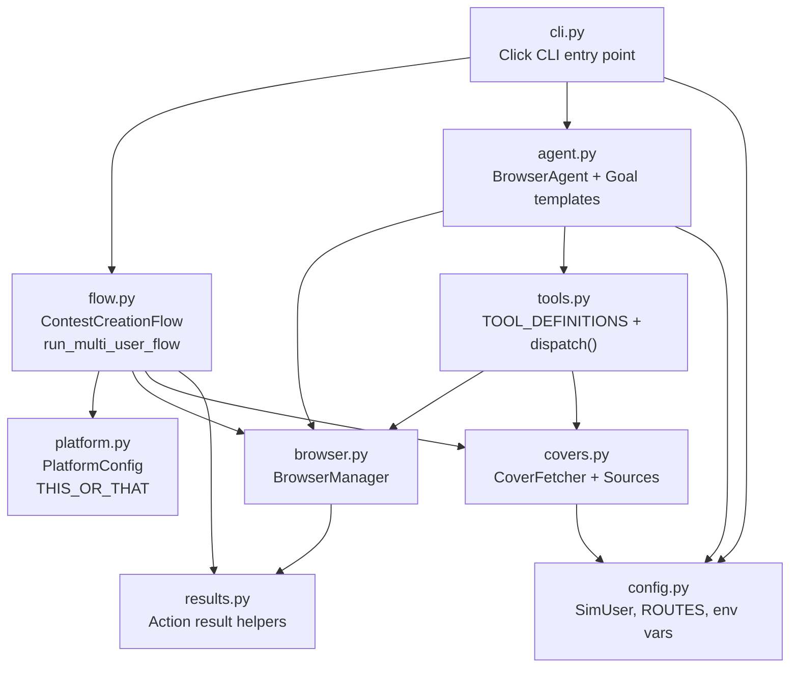

# API Reference

Auto-generated documentation for all `tot_agent` modules.

## Scripted flow modules

| Module | Description |
|---|---|
| [flow](flow.md) | Scripted contest-creation flow — research phase, browser phase, multi-user runner |
| [platform](platform.md) | `PlatformConfig` data class and built-in platform instances |

## Agentic modules

| Module | Description |
|---|---|
| [agent](agent.md) | Core agentic loop, Observer pattern, Goal templates |
| [tools](tools.md) | Claude tool schemas and dispatcher |

## Shared infrastructure

| Module | Description |
|---|---|
| [browser](browser.md) | Playwright browser context pool |
| [covers](covers.md) | Book cover fetching with Strategy pattern |
| [results](results.md) | Structured action result helpers |
| [config](config.md) | Configuration, `SimUser`, env vars |
| [cli](cli.md) | Click CLI commands |
