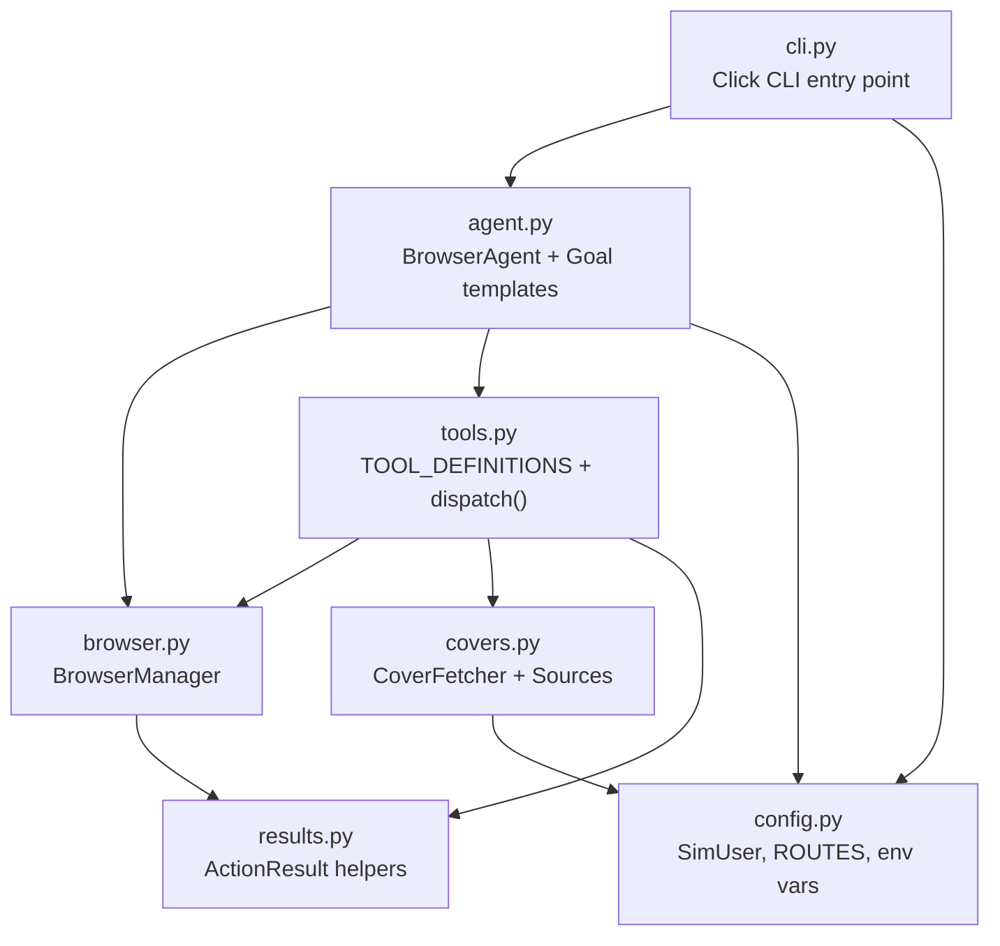

# API Reference

Auto-generated documentation for all `tot_agent` modules.

| Module | Description |
|---|---|
| [agent](agent.md) | Core agentic loop, Observer pattern, Goal templates |
| [browser](browser.md) | Playwright browser context pool |
| [covers](covers.md) | Book cover fetching with Strategy pattern |
| [tools](tools.md) | Claude tool schemas and dispatcher |
| [results](results.md) | Structured action result helpers |
| [config](config.md) | Configuration, SimUser, env vars |
| [cli](cli.md) | Click CLI commands |
