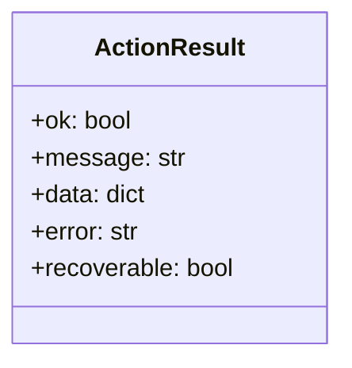

# tot_agent.results

Structured action result helpers used throughout `browser.py` and `tools.py`.

## Overview

All `BrowserManager` action methods and the `dispatch()` tool router return a
plain `dict` with a consistent shape.  The helpers in this module build those
dicts so every call site uses the same structure.

## Result shape

```python
{
    "ok": True | False,          # success flag
    "message": "Human summary",  # always present
    "data": {...},               # method-specific payload (success only)
    "error": "Exception text",   # only present on failure
    "recoverable": True | False, # only present on failure
}
```

## Class diagram



## Helper functions

| Function | Returns | Description |
|---|---|---|
| `success_result(message, **data)` | `dict` | Build an `ok=True` result with optional payload fields |
| `failure_result(message, *, error, recoverable, **data)` | `dict` | Build an `ok=False` result with error detail |
| `is_failure_result(result)` | `bool` | Return `True` when a result dict signals failure |

## Usage pattern

```python
from tot_agent.results import failure_result, is_failure_result, success_result

async def navigate(self, url: str) -> dict:
    try:
        await self.active_page.goto(url)
        return success_result(f"Navigated to {url}", url=url)
    except Exception as exc:
        return failure_result(f"Navigation failed: {url}", error=str(exc))
```

## Module reference

::: tot_agent.results
    options:
      members:
        - ActionResult
        - success_result
        - failure_result
        - is_failure_result
