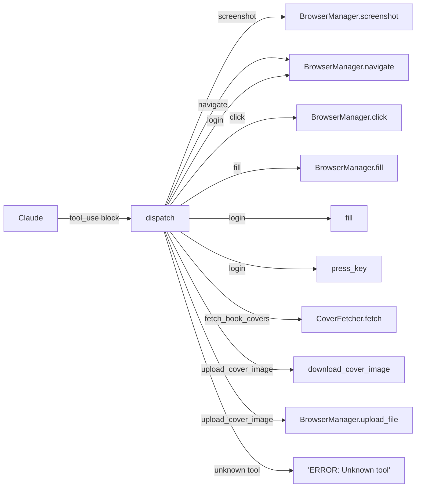
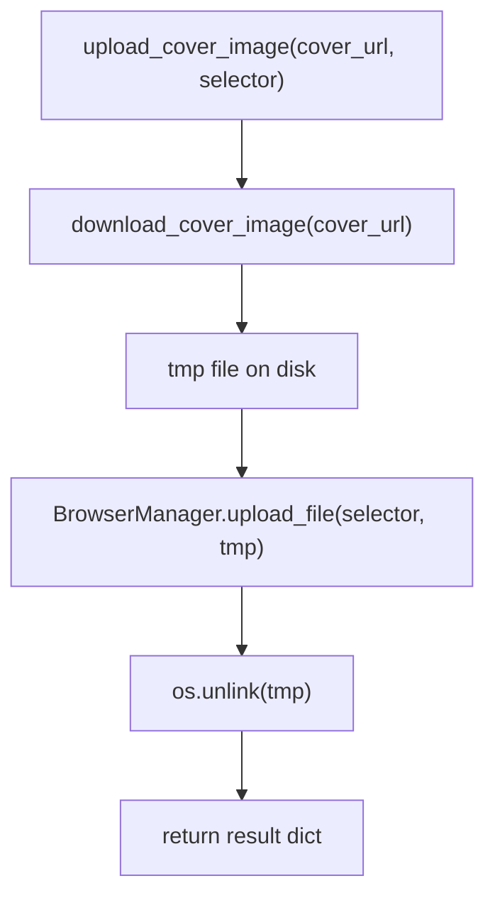

# tot_agent.tools

Claude API tool schema definitions and the `dispatch()` router.

## Tool inventory

| Tool name | Category | Description |
|---|---|---|
| `screenshot` | Vision | Capture a PNG of the active page |
| `navigate` | Navigation | Go to a URL or site-relative path |
| `click` | Interaction | Click a CSS selector or visible text |
| `fill` | Interaction | Type a value into an input field |
| `press_key` | Interaction | Press a keyboard key |
| `get_page_text` | Inspection | Return visible body text (≤ 4 000 chars) |
| `get_page_url` | Inspection | Return the current URL |
| `scroll_down` | Navigation | Scroll to the bottom of the page |
| `wait_for_element` | Synchronization | Wait for a CSS selector to appear |
| `switch_user` | Context | Change the active browser session |
| `login` | Auth | Navigate to login and submit credentials |
| `fetch_book_covers` | Data | Search for book cover images |
| `upload_cover_image` | Data | Download a cover image and upload it to a file input |

## Dispatch flow

## upload_cover_image flow

The temp file is always deleted in a `finally` block, even if the upload fails.

## Module reference

::: tot_agent.tools
    options:
      members:
        - TOOL_DEFINITIONS
        - dispatch
        - format_tool_result
