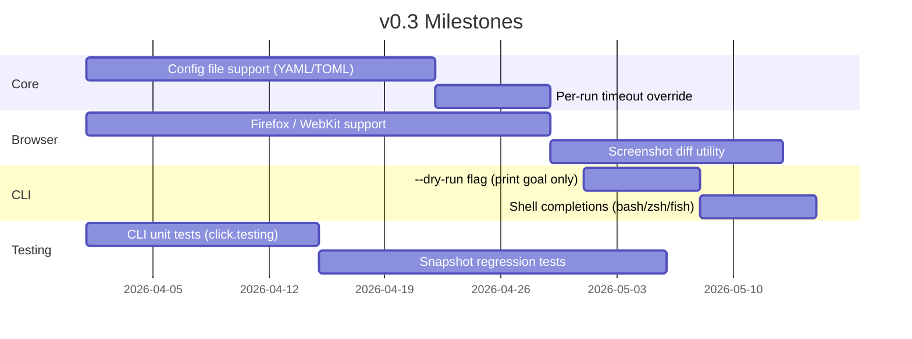
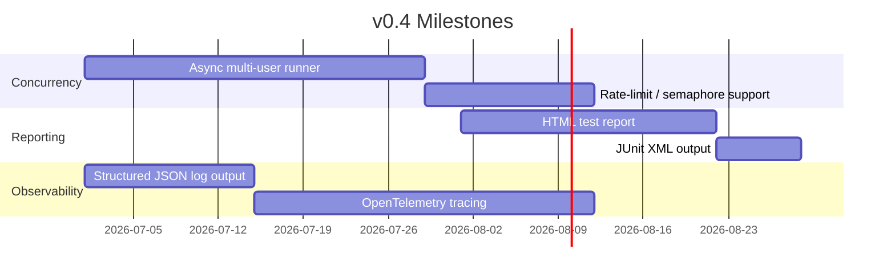

# Project Roadmap

This roadmap organises planned features into versioned milestones.  Items marked **[done]** are already implemented in the current codebase.

---

## v0.2 — Current release (2026-Q1)

**Theme:** Solid foundation — design patterns, full test suite, documented API.

- [x] Refactor to `src/` package layout (`tot_agent`)
- [x] Strategy pattern for cover sources (`OpenLibrarySource`, `GoogleBooksSource`)
- [x] Observer pattern for agent events (`ConsoleObserver`, `LoggingObserver`)
- [x] Template Method pattern for goal builders
- [x] Sphinx-compatible docstrings throughout
- [x] PEP 8 compliance
- [x] Full unit test suite (`pytest` + `pytest-asyncio` + `respx`)
- [x] Integration test suite with Playwright
- [x] Coverage reporting (`pytest-cov`)
- [x] `pyproject.toml` with hatchling backend
- [x] Full-featured CLI: `create`, `vote`, `simulate`, `seed`, `goal`, `users`, `info`, `covers`
- [x] MkDocs Material docs with Mermaid diagrams
- [x] IEEE 830 SRS
- [x] Software design document
- [x] Virtual environment setup

---

## v0.3 — Robustness & configurability (2026-Q2)

**Theme:** Make it easier to target other applications and handle more edge cases.

- [ ] **Config file support** — load `tot-agent.toml` or `tot-agent.yaml` from the project root so you don't have to pass all options via environment variables.
- [ ] **Cross-browser support** — `BrowserManager` option to launch Firefox or WebKit.
- [ ] **Screenshot diff utility** — compare screenshots between runs and highlight changes.
- [ ] **CLI unit tests** — use `click.testing.CliRunner` to test all CLI commands.
- [ ] **`--dry-run` flag** — print the generated goal string without executing.
- [ ] **Shell completions** — `tot-agent --install-completion bash|zsh|fish`.

---

## v0.4 — Parallel execution (2026-Q3)

**Theme:** Speed up multi-user simulations by running users concurrently.

- [ ] **Parallel user simulation** — run multiple `BrowserAgent` instances concurrently with an `asyncio.Semaphore` to cap API concurrency.
- [ ] **HTML test report** — generate a self-contained HTML report with screenshots for each step.
- [ ] **JUnit XML output** — CI-friendly test result format for GitHub Actions / Jenkins.
- [ ] **Structured JSON logging** — machine-readable log format for log aggregation systems.
- [ ] **OpenTelemetry tracing** — distributed tracing for multi-step agent runs.

---

## v0.5 — Platform generalisation (2026-Q4)

**Theme:** Make it trivial to target any web application without changing Python code.

- [ ] **Goal DSL** — a simple YAML/JSON format for defining test scenarios without writing Python.
- [ ] **Plugin system** — `CoverSource` and `AgentObserver` discoverable via entry points.
- [ ] **Scenario library** — shared repository of community-contributed goal templates.
- [ ] **Authentication strategies** — OAuth2, MFA simulation, cookie injection.
- [ ] **API mode** — expose the agent as a local HTTP service for IDE / CI tool integration.

---

## v1.0 — Stable release (2027-Q1)

**Theme:** Production-ready, thoroughly documented, actively maintained.

- [ ] Stable public API with semantic versioning
- [ ] 90%+ unit test coverage
- [ ] Comprehensive cookbook / examples directory
- [ ] Performance benchmarks and regression gates
- [ ] Security audit: credential handling, browser sandbox configuration
- [ ] Long-term support commitment

---

## Ideas backlog (unscheduled)

| Idea | Description |
|---|---|
| VS Code extension | Run goals directly from the editor |
| Replay mode | Record a run and replay it deterministically |
| Assertion DSL | Declarative assertions (e.g. "page must contain 'Success'") |
| GPT-4o support | Optional OpenAI backend via a provider abstraction |
| Self-healing selectors | Automatically update failing selectors using vision |
| Mobile emulation | Playwright device emulation for mobile viewport testing |

---

## Contributing

See the [GitHub repository](https://github.com/mattbriggs/this-or-that-agent) to open issues, propose features, or submit pull requests.  All roadmap items are tracked as GitHub issues labelled by milestone.
