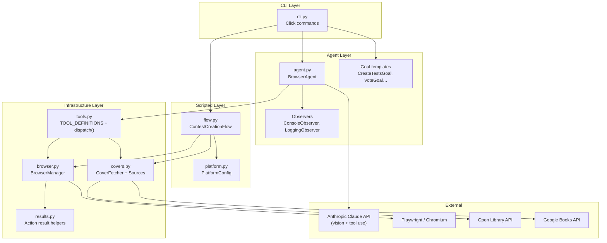
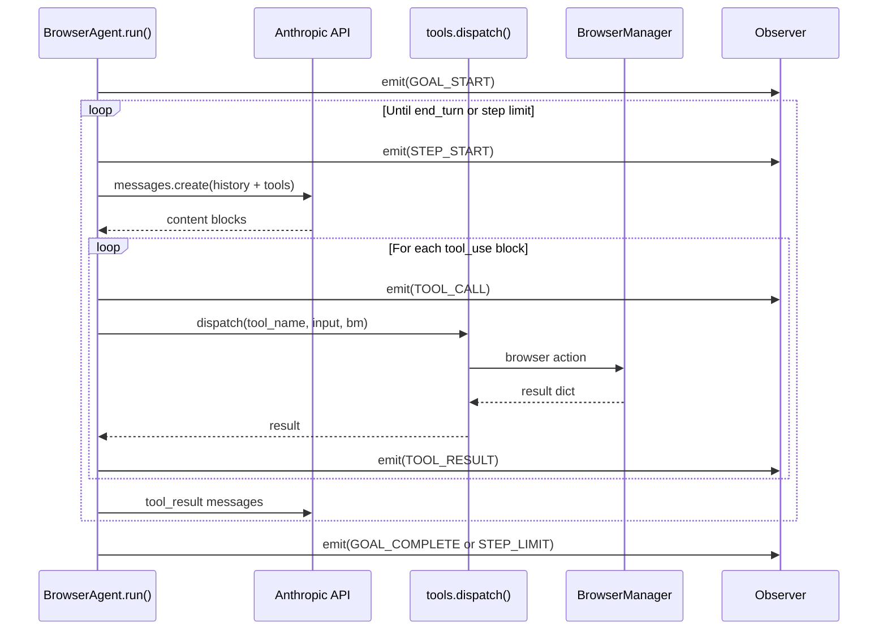
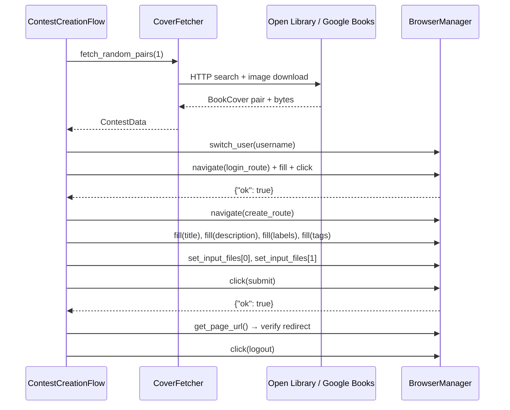
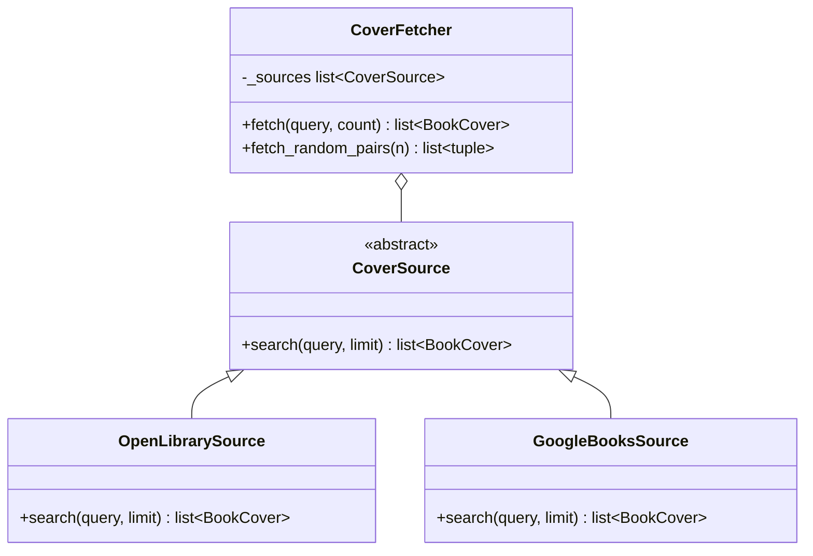
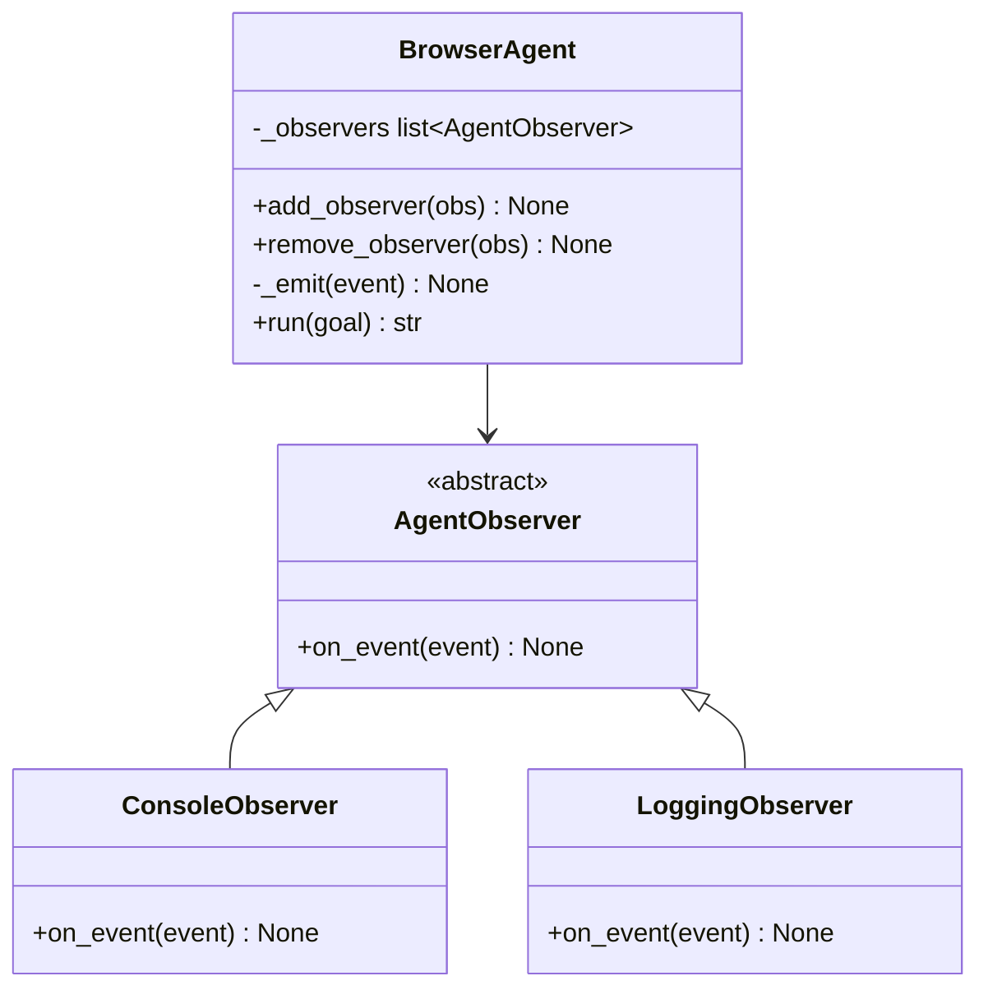
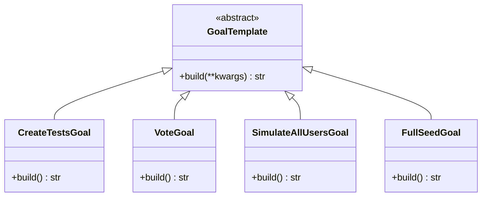
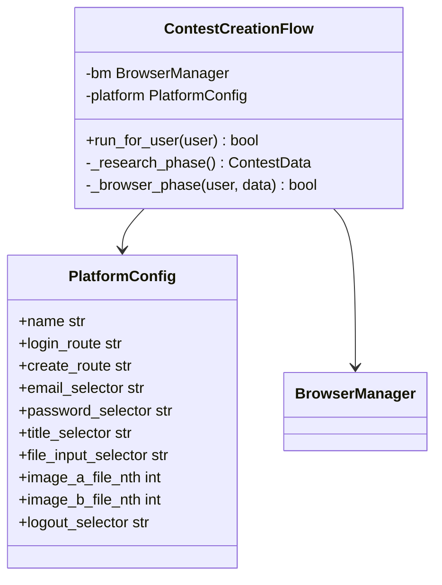
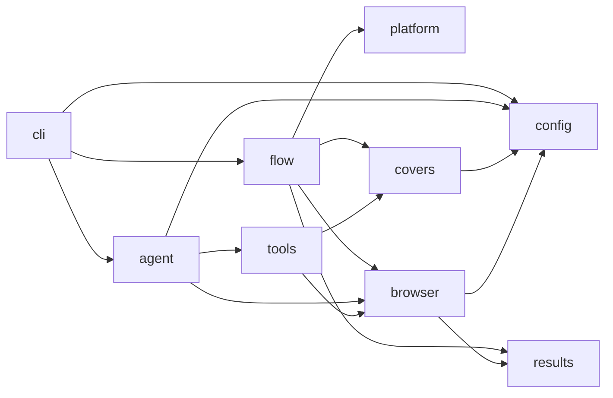
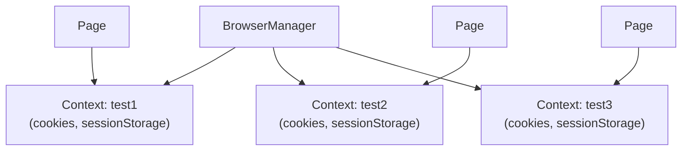

# Software Design

## 1. Introduction

`tot-agent` is a browser-driving test tool that combines two execution modes:
an **agentic mode** powered by Claude vision + tool-use, and a **scripted mode**
that executes a deterministic step sequence with no LLM involvement.  Both
modes share the same Playwright infrastructure (`BrowserManager`) and cover-
fetching layer (`CoverFetcher`).

The system was originally built for the *This-or-That* A/B book-cover testing
platform and is designed to retarget any web GUI by swapping a single
configuration object.

This document describes the architectural decisions, design patterns, module
structure, and key data flows that define the system.

---

## 2. Architectural overview



---

## 3. Two execution modes

### 3.1 Agentic mode

Claude receives a goal string and drives the browser through a tool-use loop.
After each action the agent takes a screenshot and decides the next step.



**When to use:** Exploratory testing, variable or open-ended goals, any
scenario where the UI structure is not fully known in advance.

**Cost:** Every browser interaction requires at least one Claude API call.
Open-ended goals can trigger many loop iterations.

### 3.2 Scripted mode

The flow is a fixed Python sequence.  No LLM is involved.  Each step calls
`BrowserManager` directly and checks its structured result dict immediately.



**When to use:** Repetitive, well-defined flows like contest creation.
Zero API cost.  Deterministic — same code path every run.

**How to target a new platform:** Write a `PlatformConfig` instance with
the correct routes and selectors.  The flow itself does not change.

---

## 4. Design patterns

### 4.1 Strategy — Cover sources

The `covers.py` module uses the **Strategy** pattern to make book-cover data
sources interchangeable.



**Why:** Adding a new cover source (e.g. Amazon, Goodreads) requires only
implementing `CoverSource.search()` and passing the instance to `CoverFetcher`.
No existing code changes.

### 4.2 Observer — Agent events

The `agent.py` module uses the **Observer** pattern to decouple the core loop
from output concerns.



**Why:** CI/CD pipelines need file-based logging; interactive use needs Rich
terminal output; tests need neither.  Observers can be mixed and matched
without modifying `BrowserAgent`.

### 4.3 Template Method — Goal builders

The `GoalTemplate` hierarchy applies the **Template Method** pattern to goal
string construction.



**Why:** Goal strings follow a common structure but vary in specifics.
Sub-classes encapsulate the variation while the interface stays stable.

### 4.4 Context Object — BrowserManager

`BrowserManager` acts as a **Context Object**, encapsulating all Playwright
state (browser instance, context pool, active user) behind a clean async API.
This isolates both the agent loop and the scripted flow from Playwright's
async complexity.

### 4.5 Configuration Object — PlatformConfig

`PlatformConfig` is a plain data class that declares the routes and CSS
selectors for a specific web platform's login and contest-creation UI.  The
scripted flow (`ContestCreationFlow`) reads all values from this object and
contains no hardcoded selectors.



**Why:** Retargeting the scripted flow to a new SaaS platform requires only
a new `PlatformConfig` instance.  All route navigation, form filling, file
upload indexing, and logout behavior are driven by the config alone.

---

## 5. Module dependency graph



All modules depend only on the layer below them.  `flow` and `agent` are
siblings — neither depends on the other — which means the scripted and agentic
paths can evolve independently.

---

## 6. Multi-user context model

Each simulated user gets an isolated Playwright `BrowserContext` with its own
cookies and session storage.  Switching users is O(1) — contexts are lazily
created and cached.  Both execution modes use the same pool.



The scripted flow calls `switch_user()` at the start of each run and logs out
at the end, so subsequent users start from a clean state.

---

## 7. Key design decisions

| Decision | Rationale |
|---|---|
| Two execution modes | Scripted mode eliminates token cost for repetitive flows; agentic mode handles variable goals |
| PlatformConfig as plain data | Retargeting to a new SaaS requires no logic changes — only a new config instance |
| Scripted flow stops on first failure | No retry loop means no token spiral and predictable failure signals |
| Vision-first in agentic mode | Adapts to any UI; no maintenance when the app layout changes |
| Structured result dicts (`{"ok": bool}`) | Both modes check the same contract — consistent error handling across agentic and scripted paths |
| Strategy for cover sources | Open/Closed principle — new sources don't require modifying the orchestrator |
| Observer for agent output | Separates concerns; tests can use a no-op observer |
| `src` layout | Prevents accidental imports of non-installed code during development |

---

## 8. Error handling strategy

| Layer | Approach |
|---|---|
| Scripted flow steps | Check `{"ok": bool}` result dict; log and return `False` on first failure |
| Agentic browser actions | Return `{"ok": false, ...}` dicts; Claude reads them and decides how to recover |
| Cover sources | Catch `httpx.HTTPError`, log a warning, return empty list; fall through to next source |
| File upload (scripted) | Index bounds check before `set_input_files`; logs count mismatch and returns `False` |
| Logout (scripted) | Non-fatal — logged as a warning; does not fail the run |
| CLI | Click's `BadParameter` for invalid user input; unhandled exceptions propagate |

---

## 9. Testing strategy

```mermaid
pyramid
    accTitle: Test pyramid
    accDescr: Unit tests form the base; integration tests are fewer
    section Unit (fast, offline)
        "config — SimUser, routes, env vars" : 15
        "covers — strategy pattern, HTTP mocking" : 20
        "platform — PlatformConfig field defaults" : 6
        "flow — research phase, step sequencing" : 18
        "browser — async mock, BrowserManager" : 18
        "tools — dispatch routing, format_tool_result" : 14
        "agent — observer pattern, loop logic" : 16
    section Integration (real browser / network)
        "BrowserManager — live Chromium" : 4
        "CoverFetcher — live Open Library" : 2
        "ContestCreationFlow — live app + browser" : 2
```

All external HTTP calls in unit tests are intercepted with `respx`.  Browser
tests use `pytest-asyncio` with a `live_browser` fixture that spins up real
Chromium (skipped by default in CI via `SKIP_INTEGRATION=1`).

Flow unit tests mock `BrowserManager` and `CoverFetcher` so the step sequence
can be verified without a running browser or live API.
