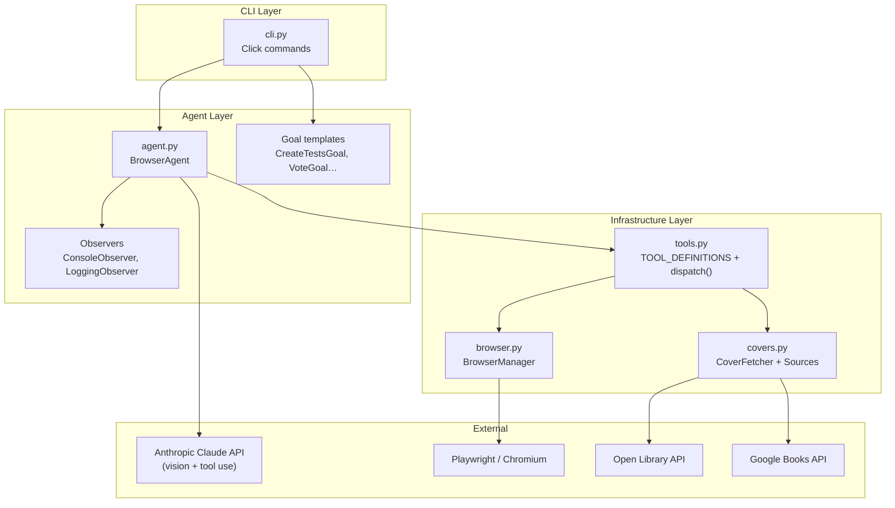
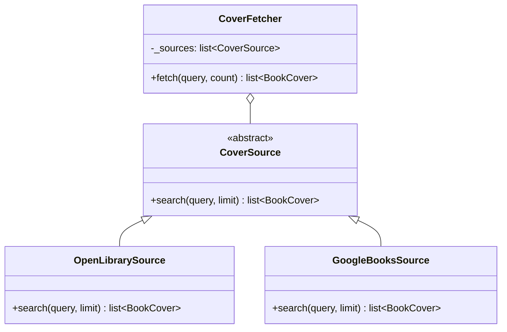
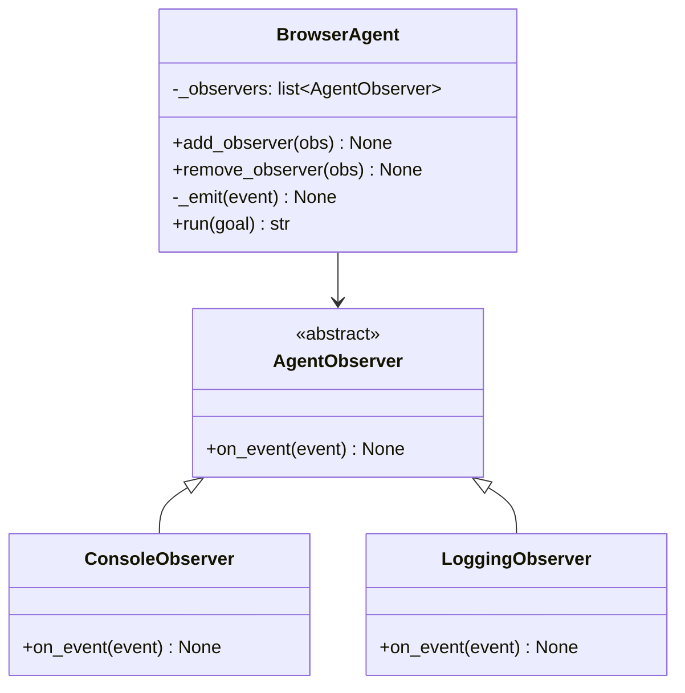
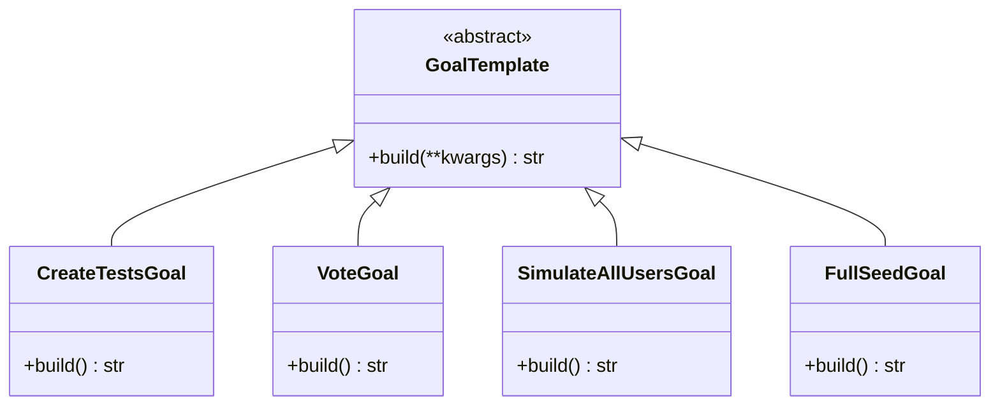
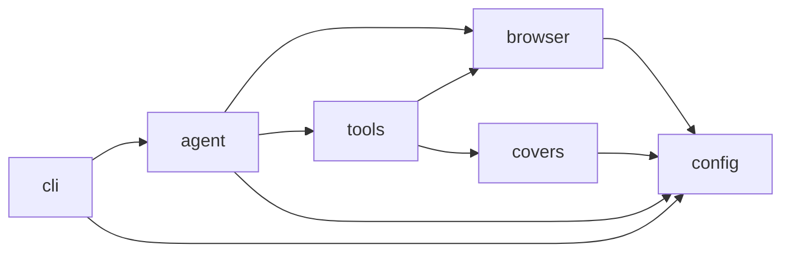
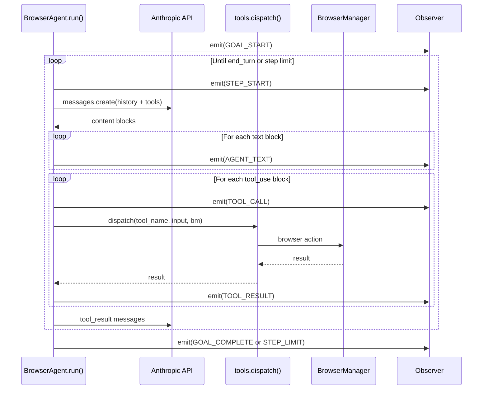
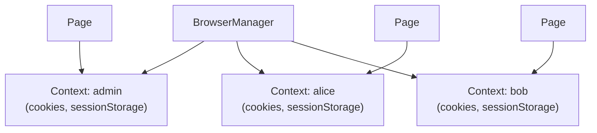

# Software Design

## 1. Introduction

`tot-agent` is an autonomous browser testing agent that combines Claude's vision and tool-use capabilities with a real Playwright browser to execute natural-language test scenarios against web applications.

This document describes the architectural decisions, design patterns, module structure, and key data flows that define the system.

---

## 2. Architectural overview



---

## 3. Design patterns

### 3.1 Strategy — Cover sources

The `covers.py` module uses the **Strategy** pattern to make book-cover data sources interchangeable.



**Why:** Adding a new cover source (e.g. Amazon, Goodreads) requires only implementing `CoverSource.search()` and passing the instance to `CoverFetcher`.  No existing code needs to change.

### 3.2 Observer — Agent events

The `agent.py` module uses the **Observer** pattern to decouple the core loop from output concerns.



**Why:** CI/CD pipelines need file-based logging; interactive use needs Rich terminal output; tests need neither.  Observers can be mixed and matched without modifying `BrowserAgent`.

### 3.3 Template Method — Goal builders

The `GoalTemplate` hierarchy applies the **Template Method** pattern to goal construction.



**Why:** Goal strings follow a common structure (context + instructions + reporting request) but vary in specifics.  Sub-classes encapsulate the variation while the interface stays stable.

### 3.4 Context Object — BrowserManager

`BrowserManager` acts as a **Context Object**, encapsulating all Playwright state (browser instance, context pool, active user) behind a clean async API.  This isolates the agent and tool dispatcher from Playwright's async complexity.

---

## 4. Module dependency graph



All modules depend only on the layer below them, preventing circular imports.

---

## 5. Agentic loop — sequence diagram



---

## 6. Multi-user context model

Each simulated user gets an isolated Playwright `BrowserContext` with its own cookies and session storage.  Switching users is O(1) — contexts are lazily created and cached.



---

## 7. Key design decisions

| Decision | Rationale |
|---|---|
| Vision-first (screenshots) over selector-based | Adapts to any UI; no maintenance when the app changes |
| Structured tool schemas | Claude can reason about available actions; schemas are validated by the API |
| Strategy for cover sources | Open/Closed principle — new sources don't require modifying the orchestrator |
| Observer for agent output | Separates concerns; tests can use a no-op observer |
| `dataclass` for `SimUser` | Zero-boilerplate, auto-generated `__eq__` and `__repr__`, IDE-friendly |
| `pyproject.toml` over `setup.py` | PEP 517/518 modern packaging standard |
| `src` layout | Prevents accidental imports of non-installed code during development |

---

## 8. Error handling strategy

| Layer | Approach |
|---|---|
| Browser actions | Return `"ERROR: ..."` strings rather than raising; the agent can read and recover |
| Cover sources | Catch `httpx.HTTPError`, log a warning, return empty list |
| Agent loop | Tool errors are fed back to Claude as text; Claude decides how to recover |
| CLI | Click's `BadParameter` for invalid user input; unhandled exceptions propagate |

---

## 9. Testing strategy

```mermaid
pyramid
    accTitle: Test pyramid
    accDescr: Unit tests form the base; integration tests are fewer
    section Unit (fast, offline)
        "config — SimUser, routes, env vars" : 15
        "covers — strategy pattern, HTTP mocking" : 20
        "browser — async mock, BrowserManager" : 18
        "tools — dispatch routing, format_tool_result" : 14
        "agent — observer pattern, loop logic" : 16
    section Integration (real browser / network)
        "BrowserManager — live Chromium" : 4
        "CoverFetcher — live Open Library" : 2
```

All external HTTP calls in unit tests are intercepted with `respx`.  Browser tests use `pytest-asyncio` with a `live_browser` fixture that spins up real Chromium (skipped by default in CI via `SKIP_INTEGRATION=1`).
