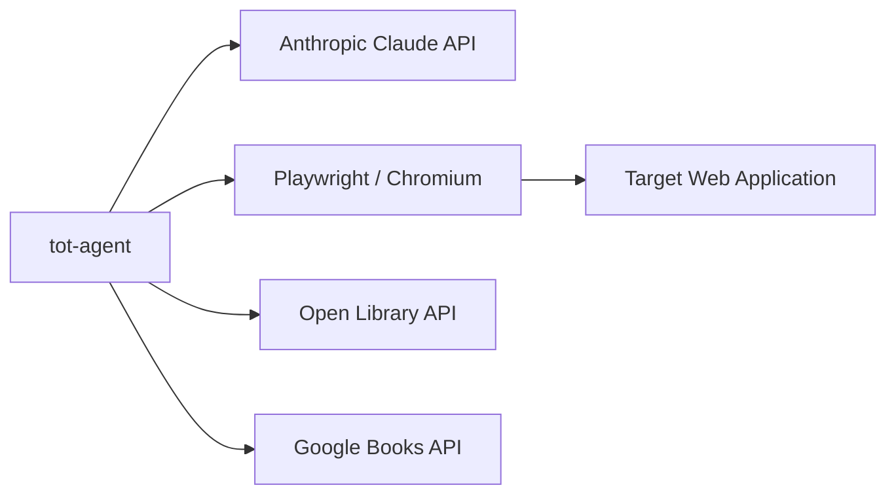

# Software Requirements Specification

**Project:** tot-agent — Autonomous Browser Testing Agent
**Version:** 1.0
**Date:** 2026-03-21
**Standard:** IEEE 830-1998

---

## 1. Introduction

### 1.1 Purpose

This Software Requirements Specification (SRS) defines the functional and non-functional requirements for `tot-agent`, an autonomous browser agent that uses Claude AI vision and tool-use to execute scripted test scenarios against web applications.  The primary audience is developers extending or maintaining the tool and stakeholders evaluating its capabilities.

### 1.2 Scope

`tot-agent` is a Python command-line tool that:

- Accepts natural-language goals or pre-built scenario commands
- Drives a Chromium browser via Playwright to execute those goals
- Uses Claude's vision capability to observe the UI state and reason about next actions
- Fetches real book cover images to seed A/B testing platforms
- Supports multi-user simulation with isolated browser sessions

The tool is initially targeted at the *This-or-That* A/B book-cover testing platform but is designed to be repurposed for any web GUI through configuration.

### 1.3 Definitions, acronyms, and abbreviations

| Term | Definition |
|---|---|
| Agent | The `BrowserAgent` instance that drives the agentic loop |
| Goal | A plain-English string describing what the agent should accomplish |
| Observer | A class implementing `AgentObserver` that receives agent lifecycle events |
| SIM_USER | A configured simulated user account (`SimUser` dataclass) |
| Tool | A function exposed to Claude via the `TOOL_DEFINITIONS` schema |
| Context | A Playwright `BrowserContext` representing one user's isolated session |
| Cover | A `BookCover` instance with title, author, image URL, and source |

### 1.4 References

- [Anthropic Claude API documentation](https://docs.anthropic.com/)
- [Playwright Python documentation](https://playwright.dev/python/)
- [IEEE 830-1998: Recommended Practice for SRS](https://standards.ieee.org/standard/830-1998.html)
- [Open Library API](https://openlibrary.org/developers/api)
- [Google Books API](https://developers.google.com/books)

### 1.5 Overview

Section 2 provides the overall product description.  Section 3 specifies detailed functional and non-functional requirements.  Section 4 includes supporting information.

---

## 2. Overall Description

### 2.1 Product perspective

`tot-agent` is a standalone command-line tool that integrates three external systems:

It is not a web service, does not have a database, and does not require a network server.  All state is in-memory within a single process execution.

### 2.2 Product functions

The tool provides the following high-level functions:

1. **Browser automation** — navigate, click, fill forms, take screenshots in a real browser
2. **AI-driven decision making** — use Claude's vision to interpret screenshots and choose the next action
3. **Multi-user simulation** — maintain separate browser sessions per simulated user
4. **Cover image fetching** — retrieve real book cover images from Open Library and Google Books
5. **Scenario execution** — execute pre-built or custom natural-language test scenarios
6. **Reporting** — summarise outcomes via console output and/or log files

### 2.3 User characteristics

| User class | Technical background | Primary use |
|---|---|---|
| Developer / QA engineer | High; comfortable with Python CLIs | Running test scenarios during development |
| Platform owner | Moderate; can run commands | Seeding demo data for a live platform |
| CI/CD pipeline | n/a (automated) | Headless regression testing |

### 2.4 Constraints

- **C-1:** Requires an Anthropic API key; incurs API usage costs.
- **C-2:** Requires a local web server running the target application.
- **C-3:** Chromium must be installed via `playwright install chromium`.
- **C-4:** Python ≥ 3.12 required (uses `match` statements, walrus operator).
- **C-5:** No cross-browser support in the initial release (Chromium only).
- **C-6:** The agent loop is limited to `MAX_AGENT_STEPS` iterations to prevent runaway API usage.

### 2.5 Assumptions and dependencies

- **A-1:** The target application is accessible at a stable URL during agent execution.
- **A-2:** Simulated user accounts exist in the target application before voting commands are run.
- **A-3:** The Open Library and Google Books APIs are publicly accessible.
- **D-1:** `anthropic` Python SDK ≥ 0.40.0.
- **D-2:** `playwright` Python package ≥ 1.44.0.
- **D-3:** `httpx` ≥ 0.27.0 for HTTP requests.

---

## 3. Specific Requirements

### 3.1 Functional requirements

#### 3.1.1 Browser automation

| ID | Requirement |
|---|---|
| **FR-BA-01** | The system SHALL navigate the active browser context to any absolute or site-relative URL. |
| **FR-BA-02** | The system SHALL click elements identified by CSS selector or visible text. |
| **FR-BA-03** | The system SHALL fill input fields identified by CSS selector with a given string value. |
| **FR-BA-04** | The system SHALL press named keyboard keys (e.g. Enter, Tab, Escape). |
| **FR-BA-05** | The system SHALL capture a full-colour PNG screenshot and return it as base64. |
| **FR-BA-06** | The system SHALL return the visible text content of the active page, capped at 4 000 characters. |
| **FR-BA-07** | The system SHALL return the current URL of the active page. |
| **FR-BA-08** | The system SHALL scroll the active page to the bottom. |
| **FR-BA-09** | The system SHALL wait up to a configurable timeout for a CSS selector to appear. |
| **FR-BA-10** | The system SHALL evaluate arbitrary JavaScript in the active page and return the result. |

#### 3.1.2 Multi-user context management

| ID | Requirement |
|---|---|
| **FR-UC-01** | The system SHALL maintain a pool of named browser contexts, one per simulated user. |
| **FR-UC-02** | The system SHALL lazily create a new context when a previously unseen user key is requested. |
| **FR-UC-03** | Switching user contexts SHALL NOT close existing contexts. |
| **FR-UC-04** | Each context SHALL have isolated cookies and session storage. |
| **FR-UC-05** | The system SHALL close all contexts when the `BrowserManager` exits. |

#### 3.1.3 Cover image fetching

| ID | Requirement |
|---|---|
| **FR-CF-01** | The system SHALL search Open Library for book covers matching a query string. |
| **FR-CF-02** | The system SHALL fall back to Google Books when Open Library returns fewer results than requested. |
| **FR-CF-03** | Returned cover URLs SHALL use HTTPS. |
| **FR-CF-04** | Results SHALL be deduplicated by normalised title. |
| **FR-CF-05** | The system SHALL verify that a cover URL resolves via HTTP HEAD on request. |
| **FR-CF-06** | The system SHALL support random cover-pair generation for seeding A/B tests. |

#### 3.1.4 Agentic loop

| ID | Requirement |
|---|---|
| **FR-AL-01** | The agent SHALL accept a plain-English goal string. |
| **FR-AL-02** | The agent SHALL pass the goal, message history, and tool schemas to Claude. |
| **FR-AL-03** | The agent SHALL execute all tool calls returned by Claude in sequence. |
| **FR-AL-04** | The agent SHALL feed tool results back to Claude as `tool_result` messages. |
| **FR-AL-05** | The agent SHALL terminate when Claude returns `stop_reason == "end_turn"`. |
| **FR-AL-06** | The agent SHALL terminate after `MAX_AGENT_STEPS` iterations if end_turn is not reached. |
| **FR-AL-07** | The agent SHALL return a plain-text summary of what was accomplished. |

#### 3.1.5 Observer / event reporting

| ID | Requirement |
|---|---|
| **FR-OB-01** | The agent SHALL emit an `AgentEvent` for each of: `GOAL_START`, `STEP_START`, `AGENT_TEXT`, `TOOL_CALL`, `TOOL_RESULT`, `GOAL_COMPLETE`, `STEP_LIMIT`. |
| **FR-OB-02** | Any number of `AgentObserver` instances SHALL be registerable at construction time. |
| **FR-OB-03** | Observers SHALL be addable and removable at runtime. |
| **FR-OB-04** | `ConsoleObserver` SHALL render events as Rich-formatted terminal output. |
| **FR-OB-05** | `LoggingObserver` SHALL write events to the Python logging hierarchy. |

#### 3.1.6 Command-line interface

| ID | Requirement |
|---|---|
| **FR-CLI-01** | The CLI SHALL provide sub-commands: `create`, `vote`, `simulate`, `seed`, `goal`, `users`, `info`, `covers`. |
| **FR-CLI-02** | The CLI SHALL support global options: `--log-level`, `--log-file`, `--model`, `--max-steps`, `--site-url`. |
| **FR-CLI-03** | The CLI SHALL print the version via `--version`. |
| **FR-CLI-04** | The `info` command SHALL display all active configuration values. |
| **FR-CLI-05** | The `covers` command SHALL work without launching a browser. |
| **FR-CLI-06** | All sub-commands that launch a browser SHALL support `--headless`. |

### 3.2 Non-functional requirements

#### 3.2.1 Performance

| ID | Requirement |
|---|---|
| **NFR-P-01** | Context switching SHALL complete in < 500 ms for already-created contexts. |
| **NFR-P-02** | Screenshots SHALL be captured within the Playwright page timeout (default 15 s). |
| **NFR-P-03** | Cover search requests SHALL complete within 10 s per source. |

#### 3.2.2 Reliability

| ID | Requirement |
|---|---|
| **NFR-R-01** | HTTP errors from cover APIs SHALL be caught; the system SHALL return an empty list rather than raising. |
| **NFR-R-02** | Browser action failures SHALL return an `"ERROR: ..."` string rather than raising an exception. |
| **NFR-R-03** | The agent loop SHALL NOT crash on unknown tool names; it SHALL return an error string to Claude. |

#### 3.2.3 Maintainability

| ID | Requirement |
|---|---|
| **NFR-M-01** | All public classes and functions SHALL have Sphinx-compatible docstrings. |
| **NFR-M-02** | Code SHALL conform to PEP 8 style. |
| **NFR-M-03** | Test coverage SHALL be tracked via `pytest-cov`; the coverage report SHALL be generated on each test run. |
| **NFR-M-04** | New cover sources SHALL be addable without modifying `CoverFetcher`. |

#### 3.2.4 Security

| ID | Requirement |
|---|---|
| **NFR-S-01** | The Anthropic API key SHALL be loaded from environment variables or `.env`; it SHALL NOT be hardcoded. |
| **NFR-S-02** | Browser contexts SHALL NOT share cookies or session storage across users. |
| **NFR-S-03** | The `--log-file` output SHALL NOT include the API key in plaintext. |

#### 3.2.5 Portability

| ID | Requirement |
|---|---|
| **NFR-PT-01** | The tool SHALL run on macOS, Linux, and Windows. |
| **NFR-PT-02** | All dependencies SHALL be declared in `pyproject.toml`. |
| **NFR-PT-03** | The tool SHALL be installable in a Python virtual environment via `pip install -e .`. |

---

## 4. Supporting information

### 4.1 Requirements traceability matrix

| Requirement | Source module | Test file |
|---|---|---|
| FR-BA-01 – FR-BA-10 | `browser.py` | `tests/unit/test_browser.py` |
| FR-UC-01 – FR-UC-05 | `browser.py` | `tests/unit/test_browser.py` |
| FR-CF-01 – FR-CF-06 | `covers.py` | `tests/unit/test_covers.py` |
| FR-AL-01 – FR-AL-07 | `agent.py` | `tests/unit/test_agent.py` |
| FR-OB-01 – FR-OB-05 | `agent.py` | `tests/unit/test_agent.py` |
| FR-CLI-01 – FR-CLI-06 | `cli.py` | (CLI tests — future) |

### 4.2 Out of scope for v1.0

- Cross-browser support (Firefox, WebKit)
- Parallel multi-user execution
- Persistent test result storage
- GUI dashboard or web API
- Authentication methods other than username/password form fill
