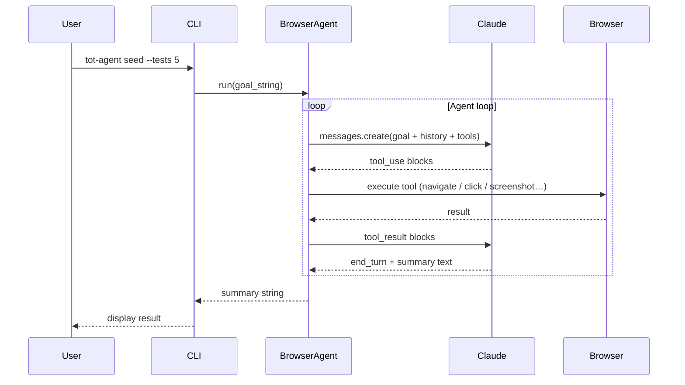

# tot-agent

**Autonomous browser agent for scripted GUI testing.**

`tot-agent` drives a real [Playwright](https://playwright.dev/) browser with [Claude](https://www.anthropic.com/claude) vision + tool-use to execute natural-language test scenarios against any web application.  It was originally built to seed and test the *This-or-That* A/B book-cover testing platform, but its core components are generic enough to target any web GUI.

---

## How it works



1. **Goal** — you provide a plain-English objective.
2. **Plan** — Claude decides which tools to call (navigate, click, fill, screenshot, …).
3. **See** — after each action, a screenshot is taken; Claude *looks* at it to decide what to do next.
4. **Act** — tools execute in a real Playwright browser.
5. **Report** — the agent summarises what it accomplished.

Because the agent uses screenshots + vision rather than hardcoded selectors, it adapts to your actual UI structure automatically.

---

## Quick start

```bash
# 1. Clone and set up
git clone https://github.com/mattbriggs/this-or-that-agent
cd this-or-that-agent
python -m venv .venv && source .venv/bin/activate
pip install -e ".[dev]"

# 2. Install Playwright browsers (one-time)
playwright install chromium

# 3. Configure
cp .env.example .env
# Edit .env — add your ANTHROPIC_API_KEY

# 4. Run!
tot-agent seed --tests 3 --headless
```

---

## Key features

| Feature | Description |
|---|---|
| Vision-first navigation | Adapts to any UI using screenshots, not fragile selectors |
| Multi-user contexts | Simulates multiple logged-in users with isolated browser sessions |
| Cover fetching | Pulls real book covers from Open Library / Google Books |
| Full-featured CLI | `create`, `vote`, `simulate`, `seed`, `goal`, `users`, `info`, `covers` |
| Strategy pattern | Swap or extend cover sources without changing orchestration code |
| Observer pattern | Attach loggers, monitors, or custom reporters to the agent loop |
| pytest suite | Unit + integration tests with coverage reports |

---

## Navigation

- [Installation](installation.md) — prerequisites and setup
- [Usage Guide](usage.md) — all CLI commands with examples
- [API Reference](api/index.md) — auto-generated module docs
- [Software Design](design/software-design.md) — architecture, patterns, diagrams
- [Requirements (SRS)](design/srs.md) — IEEE 830 specification
- [Project Roadmap](design/roadmap.md) — planned features and milestones
