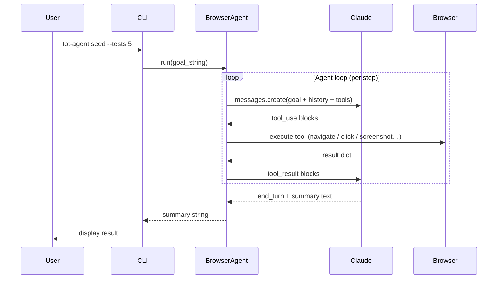
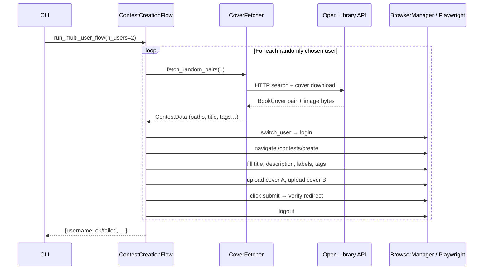

# tot-agent

**Autonomous browser agent and scripted flow runner for GUI testing.**

`tot-agent` drives a real [Playwright](https://playwright.dev/) browser with
[Claude](https://www.anthropic.com/claude) vision + tool-use to execute
natural-language test scenarios, and also supports a zero-LLM scripted mode
for well-defined, token-efficient flows.  It was originally built to seed and
test the *This-or-That* A/B book-cover testing platform, but its core
components are designed to target any web GUI.

---

## Two execution modes

`tot-agent` offers two ways to drive the browser.  Choose based on the task:

| | Agentic mode | Scripted mode |
|---|---|---|
| **Commands** | `create`, `vote`, `simulate`, `seed`, `goal` | `contest` |
| **Decision-maker** | Claude (LLM) | Python (deterministic) |
| **Uses Claude API** | Yes — every step | No — zero API calls |
| **Best for** | Exploration, complex / variable goals | Repetitive, well-defined flows |
| **Selector knowledge** | Discovers from screenshots | Declared in `PlatformConfig` |
| **Target a new SaaS** | Works automatically via vision | Write one `PlatformConfig` |

---

## Agentic mode

Claude sees the page, decides what to do, and drives the browser through a
tool-use loop.



1. **Goal** — you provide a plain-English objective.
2. **Plan** — Claude decides which tools to call (navigate, click, fill, screenshot, …).
3. **See** — after each action, a screenshot is taken; Claude looks at it to decide the next step.
4. **Act** — tools execute in a real Playwright browser.
5. **Report** — the agent summarises what it accomplished.

---

## Scripted mode

The flow is pre-defined in Python.  Claude is not involved.  Each step calls
`BrowserManager` directly and checks the result dict immediately.



1. **Research** — `CoverFetcher` fetches a random book cover pair and downloads both images locally.
2. **Login** — Playwright fills credentials and confirms the redirect.
3. **Fill** — every form field is filled from `ContestData` using selectors from `PlatformConfig`.
4. **Upload** — cover images are set on `<input type="file">` elements by index.
5. **Submit** — the form is submitted; the URL is checked to confirm the redirect.
6. **Logout** — the user is logged out before the next user runs.

The platform's routes and selectors live in a single `PlatformConfig` data class.
Swapping platforms means writing one new config — not touching any flow logic.

---

## Quick start

```bash
# 1. Clone and install
git clone https://github.com/mattbriggs/this-or-that-agent
cd this-or-that-agent
python -m venv .venv && source .venv/bin/activate
pip install -e ".[dev]"

# 2. Install Playwright browser (one-time)
playwright install chromium

# 3. Configure
cp .env.example .env
# Edit .env — add ANTHROPIC_API_KEY (only needed for agentic mode)

# 4a. Scripted flow — no API key needed
tot-agent contest --users 2

# 4b. Agentic mode — uses Claude API
tot-agent seed --tests 3 --headless
```

---

## Key features

| Feature | Description |
|---|---|
| Scripted flow | Deterministic, zero-LLM contest creation — no token cost |
| Agentic mode | Vision-first navigation adapts to any UI using screenshots |
| PlatformConfig | Single data class to target a new SaaS — routes + selectors only |
| Multi-user contexts | Each simulated user gets an isolated Playwright browser session |
| Random user selection | Scripted flow picks users randomly from the configured roster |
| Cover fetching | Real book covers from Open Library / Google Books, auto-downloaded |
| Full-featured CLI | `contest`, `create`, `vote`, `simulate`, `seed`, `goal`, `covers`, `users`, `info` |
| Strategy pattern | Swap or extend cover sources without changing orchestration code |
| Observer pattern | Attach loggers, monitors, or custom reporters to the agent loop |
| pytest suite | Unit + integration tests with coverage reports |

---

## Navigation

- [Installation](installation.md) — prerequisites and setup
- [Usage Guide](usage.md) — all CLI commands with examples
- [Adding a Platform](adding-a-platform.md) — write a `PlatformConfig` for a new SaaS
- [API Reference](api/index.md) — auto-generated module docs
- [Software Design](design/software-design.md) — architecture, patterns, diagrams
- [Requirements (SRS)](design/srs.md) — IEEE 830 specification
- [Project Roadmap](design/roadmap.md) — planned features and milestones
